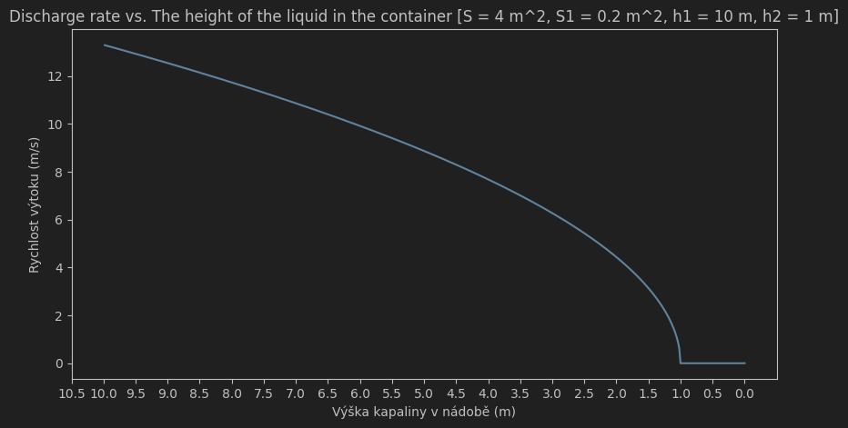
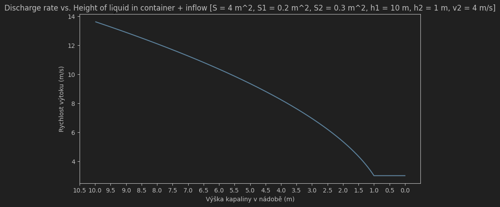

# Hydrodynamics

## Task 1

> We have a cylindrical container with a base area S and height h1. At a height h2 from the base (h2<h1), there is an
> outlet
> opening with a cross-sectional area S1, through which water flows out of the container. Graphically show the
> dependence
> of the outflow velocity v1 on the height of the liquid in the container as the liquid flows out (and thus decreases in
> the container).

### Properties

- Cylinder base area (S): 4 m^2
- Outlet area (S1): 0.2 m^2
- Outlet height (h2): 1 m
- Gravitational acceleration (g): 9.81 m/s^2

### Graph

## Task 2

> The situation as in point 1), in addition, we replenish the liquid in the container with an inflow of cross-sectional
> area S2

### Properties

- Inflow area (S2): 0.3 m^2
- Inflow velocity (v2): 40 m/s

### Graph

