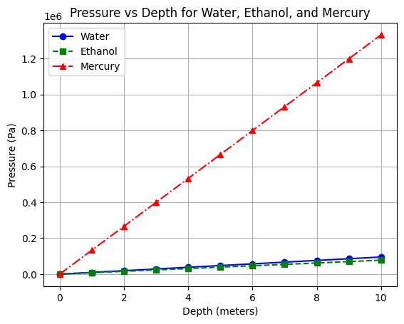
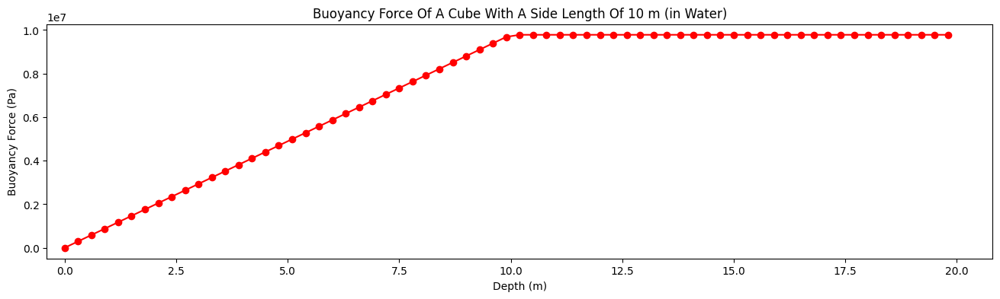
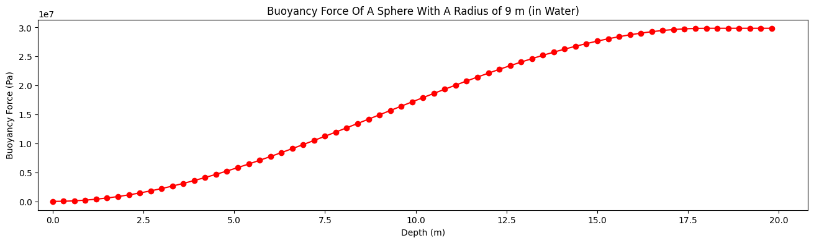

# Hydrostatics

 
## Task 1

> We have a cylindrical container filled with different fluids (water, ethanol, and mercury). Graphically show the
> dependence of the pressure at various depths for each fluid.

### Properties

- Depth range: 0 to 10 meters
- Fluids: Water, Ethanol, Mercury
- Density of Water: 1000 kg/m^3
- Density of Ethanol: 789 kg/m^3
- Density of Mercury: 13534 kg/m^3
- Gravitational acceleration (g): 9.81 m/s^2

### Graph

## Task 2

> Calculate the buoyant force acting on a cube submerged in water at various depths.

### Properties

- Cube edge length: 10 meters
- Depth range: 0 to 20 meters
- Fluid: Water
- Density of Water: 1000 kg/m^3
- Gravitational acceleration (g): 9.81 m/s^2

### Graph

## Task 3

> Calculate the buoyant force acting on a sphere submerged in water at various depths.

### Properties

- Sphere radius: 9 meters
- Depth range: 0 to 20 meters
- Fluid: Water
- Density of Water: 1000 kg/m^3
- Gravitational acceleration (g): 9.81 m/s^2

### Graph

